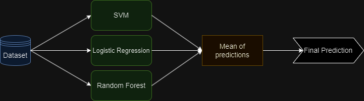

# Ensemble Modeling

</img>

Cuando un dataset es complejo capturar las relaciones entre sus variables con un solo modelo de ML puede ser difícil y en la mayoría de los dataset no se puede lograr. En estas circunstancias es cuando se utiliza una combinación de varios modelos.

## Voting Ensembling

Útil cuando se tienen dos o más modelos que exhiben buen desempeño. Se puede utilizar para tareas de regresión (promediando las predicciones de los modelos) y clasificación (utilizando el modo de las predicciones de los modelos).

### Voting Regressor

</img>

### Voting Classifier

Existen dos formas de realizar la combinación de modelos para este tipo de tareas:
- Hard Voting: Decisión por mayoría.
- Soft Voting: Decisión por mayoría basado en la probabilidad de las predicciones. Cada modelo para decidir una clase u otra lo hace en base a probabilidades. Con soft voting se promedia las probabilidades y si resulta por debajo de 0.5 es una clase y si es superior es la otra (clasificación binaria)

</img>

## Stacking Ensembling

Stacking ensembling es una extensión de voting ensembling en el cual se utiliza un meta-learner. El meta-learner es otro modelo de ML donde las características de sus datos de entrenamiento son las predicciones de los modelos base.

Al igual que los modelos base el meta-learner también tiene una gran probabilidad de overfitting. De hecho en esta configuración es muy probable que suceda. Por esta razón, es conveniente siempre utilizar en conjunto algún método de cross-validation.

## Blending Ensembling

Blending Ensembling consiste en dividir el dataset en tres conjuntos de datos: train, validation, y test. El conjunto de train se utiliza para entrenar los base models. Los base models entrenados predicen con los conjuntos de validation y test.

Las predicciones con el conjunto de validation se utilizan para entrenar el meta-learner. Y el conjunto de test se utiliza para la validación del meta-learner.

